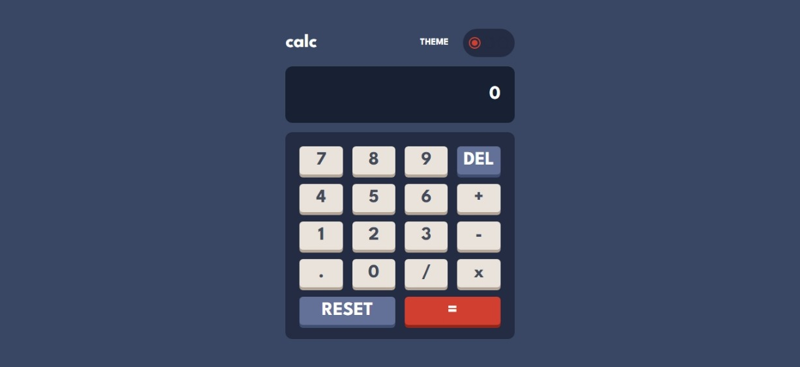
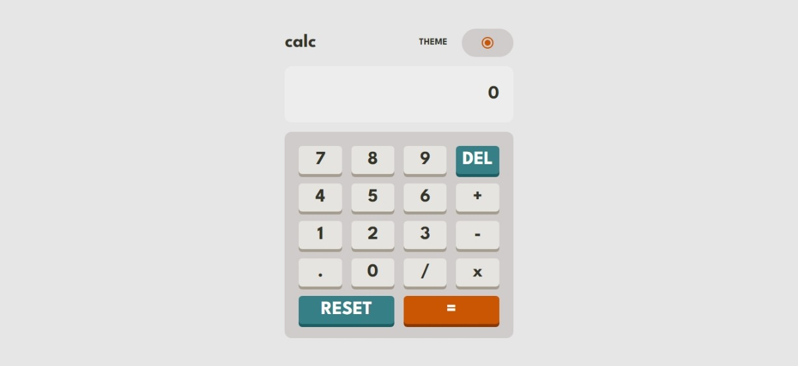
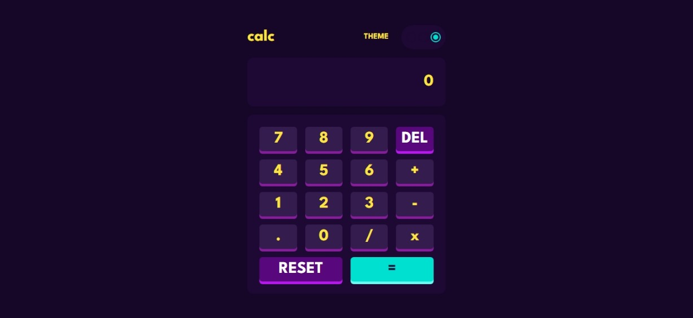

# Frontend Mentor - Calculator app solution

This is a solution to the [Calculator app challenge on Frontend Mentor](https://www.frontendmentor.io/challenges/calculator-app-9lteq5N29). Frontend Mentor challenges help you improve your coding skills by building realistic projects.

## Table of contents

- [Overview](#overview)
  - [The challenge](#the-challenge)
  - [Screenshot](#screenshot)
  - [Links](#links)
- [My process](#my-process)
  - [Built with](#built-with)
  - [What I learned](#what-i-learned)
  - [Continued development](#continued-development)
  - [Useful resources](#useful-resources)
- [Author](#author)
- [Acknowledgments](#acknowledgments)

## Overview

### The challenge

Users should be able to:

- See the size of the elements adjust based on their device's screen size
- Perform mathmatical operations like addition, subtraction, multiplication, and division
- Adjust the color theme based on their preference

### Screenshot





### Links

- Solution URL: [GitHub](https://github.com/Rodrigogzmn6/frontendmentor.io/tree/main/Projects/01-Calculator)
- Live Site URL: [Netlify](https://rodrigogzmn6-frontendmentorio-01.netlify.app/)

## My process

### Built with

- Semantic HTML5 markup
- CSS custom properties
- Flexbox
- CSS Grid
- Mobile-first workflow
- [React](https://reactjs.org/) - JS library
- [Tailwind CSS](https://tailwindcss.com/) - For styles

### What I learned

Use this section to recap over some of your major learnings while working through this project. Writing these out and providing code samples of areas you want to highlight is a great way to reinforce your own knowledge.

To see how you can add code snippets, see below:

Using constants to simplify css

```css
.application.dark {
  background-color: var(--d-main-bg);
  color: var(--d-light-txt);
}
```

Succesfully managing state with useState hook

```js
const [equation, setEquation] = useState({
  number1: "",
  operation: "",
  number2: "",
});
```

Rerendering elements when needed with useEffect

```js
useEffect(() => {}, [theme]);
```

Using context to modify the theme across the entire web

```js
<ThemeContext.Provider value={{ theme, changeTheme }}>
  {children}
</ThemeContext.Provider>
```

### Useful resources

- [ReactJS](https://reactjs.org/) - It's the biggest JS library.
- [Tailwind CSS](https://tailwindcss.com/) - It saves a lot of time and css code.
- [Chat GPT](https://chat.openai.com/) - A really amazing technology that helps you with some specific (or not that specific) topics.

## Author

- GitHub - [Rodrigogzmn6](https://github.com/Rodrigogzmn6)
- Frontend Mentor - [@Rodrigogzmn6](https://www.frontendmentor.io/profile/Rodrigogzmn6)
- LinkedIn - [Rodrigo Isaac Guzmán](https://www.linkedin.com/in/rodrigo-isaac-guzm%C3%A1n-99951418a/)
